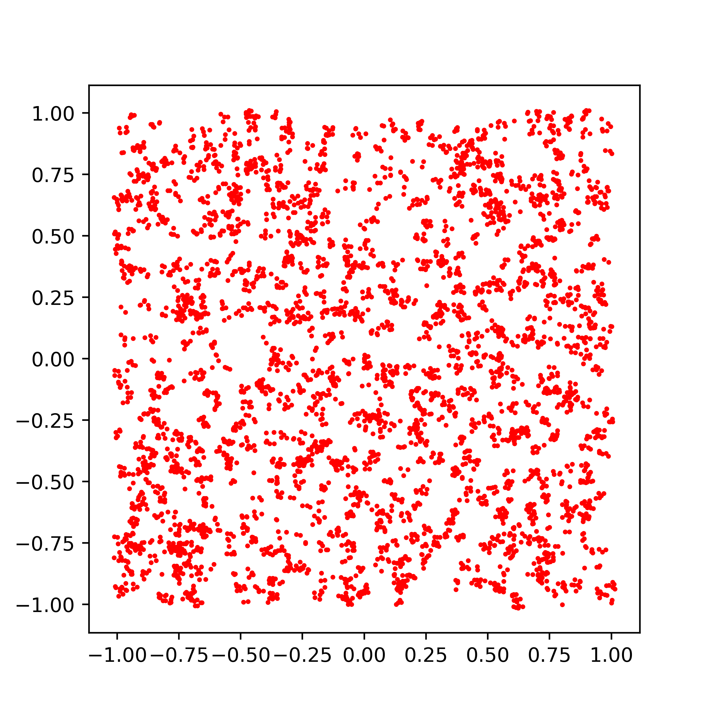
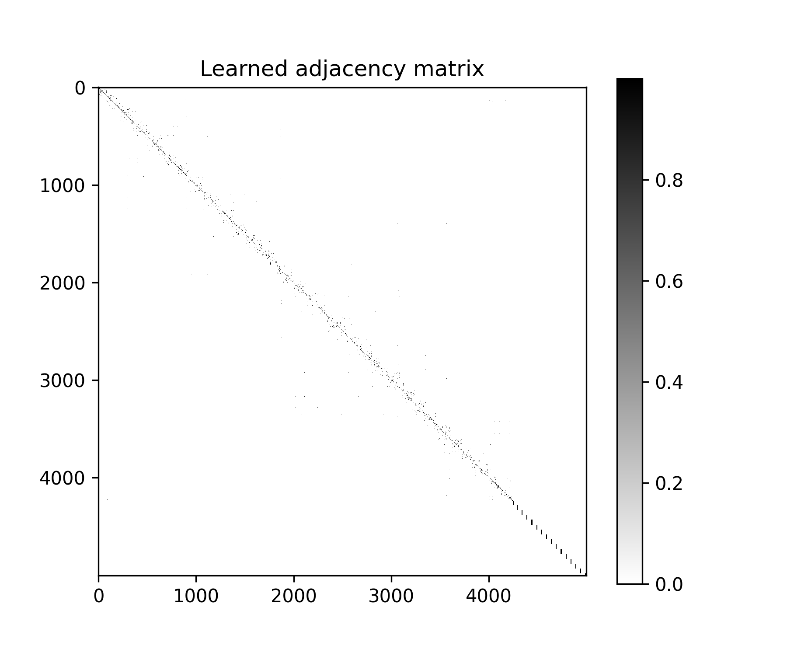
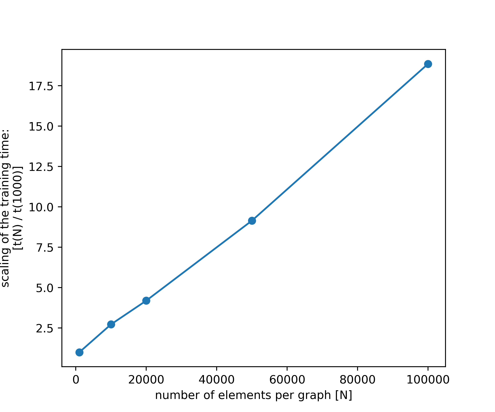

SparseDistance
==============

Efficiently generate sparse graph adjacency matrices using tensorflow, including gradient propagation and minibatches.

 - Input: a set of elements with features, shape `(N_batch, N_elem, N_feat)`
 - Output: a sparse adjacency matrix with shape `(N_batch, N_elem, N_elem)`, the elements of which can be differentiated with respect to the input
 - Parameters: bin size M, number of neighbors K

```python
from sparsedistance.models import SparseHashedNNDistance
from sparsedistance.utils import sparse_dense_matmult_batch, pairwise_dist

num_batches = 10
num_points_per_batch = 1000
num_features = 32

X = np.array(np.random.randn(num_batches, num_points_per_batch, num_features), dtype=np.float32)
y = np.array(np.random.randn(num_batches, num_points_per_batch, ), dtype=np.float32)

#show that we can take a gradient of stuff with respect to the distance matrix values (but not indices!)
dense_transform = tf.keras.layers.Dense(128)
dm_layer = SparseHashedNNDistance()

with tf.GradientTape(persistent=True) as g:
    X_transformed = dense_transform(X)
    dm = dm_layer(X_transformed)

    ret = sparse_dense_matmult_batch(dm, X)

    #reduce the output to a single scalar, just for demonstration purposes
    ret = tf.reduce_sum(ret)

grad = g.gradient(ret, dense_transform.weights)
```

On the following images, you see the input set on the left and the learned graph structure (edges) on the right.
<p float="left">
  
  
</p>

Here, we show the learned distance matrix on a toy clustering problem on the left and the scaling of the training time on the right.
<p float="left">
  
  
</p>

Features:
 - [x] Work on a modest GPU (e.g. 2060S) or a CPU
 - [x] Uses only native TF 2.x operations
 - [x] Better than quadratic scaling
 - [x] Fast evaluation and efficient memory use, up to 100k+ elements

Based on the Reformer [1] and GravNet [2] papers.

 - [1] https://arxiv.org/abs/2001.04451
 - [2] https://arxiv.org/abs/1902.07987